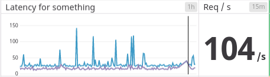
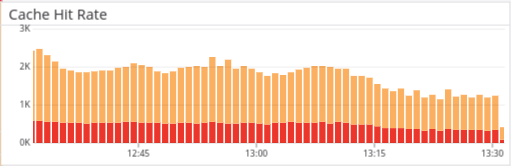
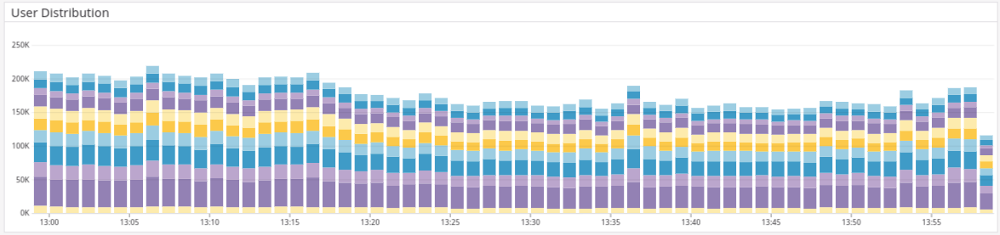
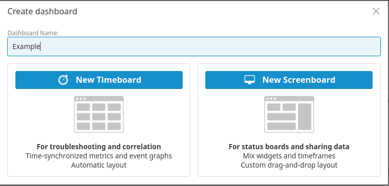
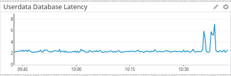
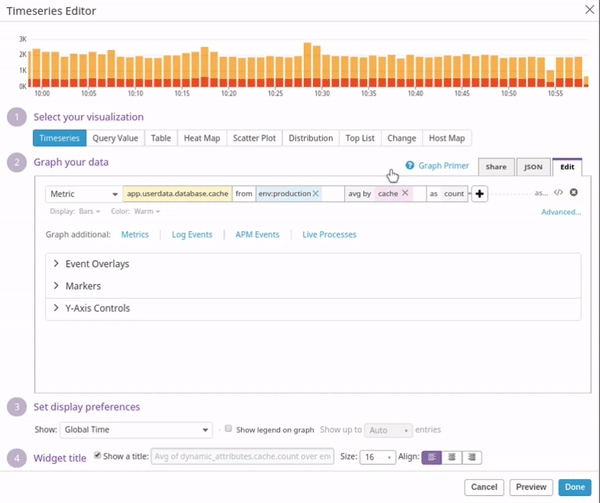

# Datadog Guidelines

   * [Datadog Guidelines](#datadog-guidelines)
      * [Introduction](#introduction)
      * [Example](#example)
         * [Latency and Request Per Second](#latency-and-request-per-second)
         * [Cache Hit Rate](#cache-hit-rate)
         * [Distribution](#distribution)
      * [The Code](#the-code)
         * [Creating Datadog Client](#creating-datadog-client)
         * [Sending Metrics](#sending-metrics)
            * [Histogram](#histogram)
            * [Count](#count)
      * [Best Practice](#best-practice)
         * [Metrics Name](#metrics-name)
         * [What To Monitor](#what-to-monitor)
      * [Monitoring](#monitoring)

## Introduction

When is the last time you so frustrated because you can't find why your service becomes slow. Probably never if you just graduated or didn't care about your company service. However, you should or will learn more about it now. We will talk more about [Datadog](https://www.datadoghq.com), not about what is Datadog but how we use it to make our life easier.

## Example

We will see some example of monitor that Datadog can track.

### Latency and Request Per Second



Above image is called Time Series Graph, the blue line represents max latency, and the purple line represents 95 percentiles of latency in 1 hour. If you are wondering why we don't use average, that's out of the scope of this guideline, but you can read it more in [here](https://www.elastic.co/blog/averages-can-dangerous-use-percentile) and [here](https://www.dynatrace.com/news/blog/why-averages-suck-and-percentiles-are-great/). We can see from that graph that service has 150 ms as max latency and below 50 ms for 95 percentiles. The number on the right side is **Request Per Second** (RPS). If you notice, we set the time window 15 minutes for RPS. It's because we want to get the current RPS using the average.

### Cache Hit Rate



In this graph, we track the cache hit rate for our service. The orange bar represents cache that hit, and the red one is the cache that miss. We can know that our cache hit rate is above 70% from the graph. Imagine that we don't track or monitor the cache hit rate and one day someone deploying some code that invalidates our cache.

Suddenly that 70% of traffic will hit directly to our data source, e.g., database or API, and we will not know if that happens. Well, maybe we will know it later after suddenly our service becomes slow or even worst, our data source slowly dying.

### Distribution 



The graph tracks user distribution that using our service. Each color in the bar represents a different user category, let's say the light blue color represents user tier 1, and dark purple color represents user tier 10. Now we know that tier 10 is more than tier 1, and we can use this for analytics.

## The Code

So we already learn some example of what we can monitor, now let's see how we implement it in our service. This example will using [Golang](https://golang.org) and [datadog-go](https://github.com/DataDog/datadog-go) library.

### Creating Datadog Client

```go
import (
	"log"

	"github.com/DataDog/datadog-go/statsd"
)

func main() {
    // create datadog client
    client, err := statsd.New("your.datadog.end.point:2811")
	if err != nil {
		log.Fatal("Failed to initialized datadog client", err)
	}
    
    // prefix for every metric with the app name
    client.Namespace("your-service-name")
    
    // put default tags for every metric
    client.Tags = append(client.Tags, []string{"env:development", "host:127.0.0.1"}...)
}
```

We create a Datadog client that has `your-service-name` as the prefix, and we have two default tags, environment (env) and service IP (host) for each metric. You don't need to create a new Datadog client if your service already has it, you can reuse it.

### Sending Metrics

There are several types of metrics that we can send to Datadog, if you want to learn more about them all you can read it [here](https://docs.datadoghq.com/developers/metrics/) but what we will discuss here are the metrics we used to create above [example](#Example).

```
Currently we are using empty tags, but usually it's better to put some tags to grouping our
metrics for easier use. We will talk more about it in the next section.
```


#### Histogram

```go
start := time.Now()

// func that we want to monitor
doSomethingHere()

// Histogram(name string, value float64, tags []string, rate float64)
client.Histogram("metric.name", time.Since(start).Seconds(), []string{}, 1)
```

Let's say our `doSomethingHere()` function run for 2 seconds. With the above example, we send a metric with name `metric.name`, value `2.0`, empty tags, and rate 1. After that, we can create latency and RPS monitor. 

#### Count

```go
// we have map for our cache
cache map[string]string

func getData(key string) (result string) {
    var cacheStatus string
    
    // check if the key exist in our cache
    if c, exist := cache[key]; exist {
        result = c
        cacheStatus = "hit"
    } else {
        result = getDataFromTheSource()
        cache[key] = result
        cacheStatus = "miss"
    }
}

// Count(name string, value float64, tags []string, rate float64)
client.Count("metric.name", 1, []string{"cache:"+cacheStatus}, 1)
```

Oh hey we just create a simple cache with monitoring :smiley:. If the cache exist, set the `cacheStatus` to `hit` otherwise set it as a `miss`. After that we can create cache hit rate monitor. For distribution monitor, we can create it using `Count` function. As example, we can put `distribution` tags with several values e.g., `distribution:1`, `distribution:2`, `distribution:3`, etc.

## Best Practice

It's better to have a standard for naming convention for our metrics because from my experience when there is no standard or guidelines, everyone will creating their own naming convention, and it will make things complicated.

```
Tags value will become lowercase, so don't bother to use camelCase in tags
```

### Metrics Name

Don't create a new metrics name for each of your function. I believe you have a lot of functions, use tags for them. Let's say we have some functions that call to several databases to construct user data.

```go
func getOne() {
    client.Histogram("userdata.database", 1, []string{"function:getone"}, 1)
}

func getTwo(){
    client.Histogram("userdata.database", 1, []string{"function:gettwo"}, 1)
}
```

We group the functions by metrics name. For the metrics name, I prefer to use this naming convention.

```
servicename.module.process
```

Service name is already set as a prefix when we create our client, so we don't need to put that anymore.

Module is what we we going to monitor. For the above example, we want to track user data process.

Process is what we are doing in the process. For the above example, we get the data from databases, so we put database as a process. If you are getting the data from API, you can change it to api or the API name.

Let's say the process is not that simple, and there is subprocess. Let's add the cache example to our user data process, we can add it like this.

```go
client.Histogram("userdata.database.cache", 1, []string{"cache:hit"}, 1)
```

### What To Monitor

We should monitor all functions that are calling external data source, e.g., database, Redis, Elasticsearch, API, etc. We don't need to monitor simple function that is only calculating or checking statements.

## Monitoring

Yay! We learn to send metrics to Datadog, but it's useless if we aren't monitoring it. I assume you have already had account and access to Datadog. Go to the [dashboard list page](https://app.datadoghq.com/dashboard/lists) and create a new dashboard. There will be a pop up to pick our board type. I prefer Screenboard because I can customize a lot of things here, but you can choose whichever you want. If your team already has a dashboard, you can search it in the dashboard list and just and the metrics on that dashboard.



After creating the dashboard, you can drag the metrics we want to track from the top of the screen. We will use `Timeseries` and `Query Value`. We will create all monitor from all [example](#Example) above.


Let's start with `Timeseries` to create latency monitor. Just click and drag the template to your dashboard. Put your metrics name and tags, for my case `app.userdata.database` is my metrics name and `env:development` is my tags. There will be several metrics options when you put your metrics name. For now, we will use `.95percentile` and put the widget title if you want to change the default metrics title.


And here we go your metrics is available now.



But hey we have not used the tags yet. Let's see why I'm encouraging the use of tags to make our life easier. We will be using the cache hit rate example.



Above graph, using display `bars` and we group it by `cache` tags. The graph will group it automatically from what we send, in this case, `cache:hit` and `cache:miss`. 

